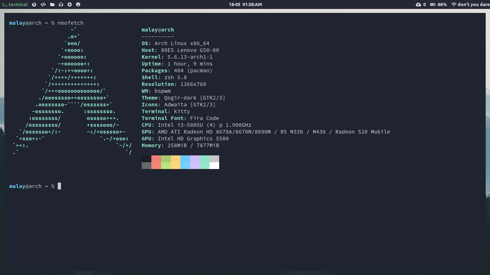
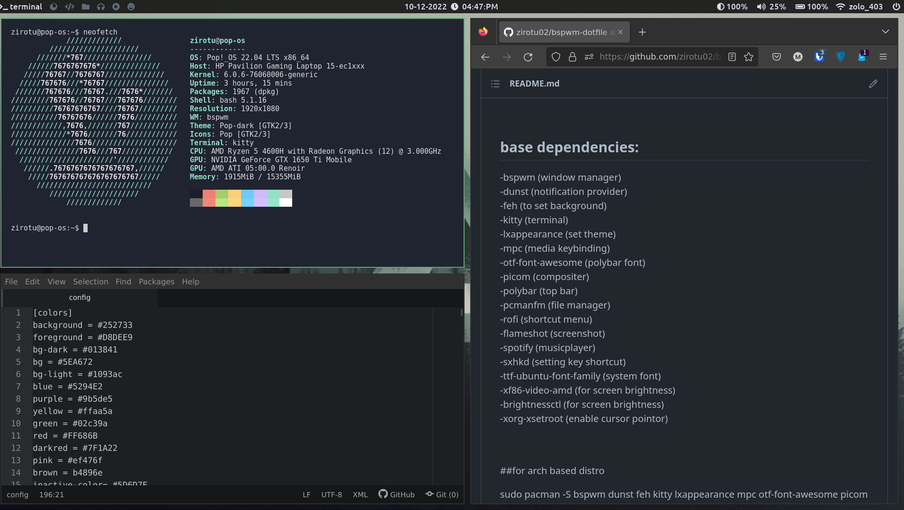

# bspwm-dotfiles

project:dotfiles:https://github.com/raj-shekhar26/dotfiles/tree/master/bspwm
author:https://github.com/raj-shekhar26
  
**This is for arch linux (name of dependencies may be different in other distro)**
  
  
 
  
## base dependencies:
-bspwm                  (window manager) 
-dunst                  (notification provider) 
-kitty                  (terminal) 
-lxappearance           (set theme) 
-mpc                    (media keybinding) 
-otf-font-awesome       (polybar font) 
-compton-tryone-git     (compositer) 
-polybar                (top bar) 
-pcmanfm                (file manager) 
-rofi                   (shortcut menu) 
-scrot                  (screenshot) 
-spotify                (musicplayer) 
-sxhkd                  (setting key shortcut) 
-ttf-ubuntu-font-family (system font) 
-xf86-video-intel       (for screen brightness) 
-xorg-xbacklight        (for screen brightness) 
-feh                    (to set background)
  

## guide to setup audio: (alsa is used in sxhkd to set volume up/down)
  
### dependencies:
-alsa-libs  
-alsa-utils  

### steps:
-open terminal and find your card using this cmnd (cat proc/asound/cards)  
(my card was "1")  

-then create a file (/etc/asound.conf) and enter this :(replace 1 with your card)  
defaults.pcm.card 1  
defaults.ctl.card 1  

## theme (set from lxapperance)
-qogir-dark  
-wallpaper (https://www.pexels.com/photo/1287075/download/?search_query=&tracking_id=5iwz41q8veo)

## keybindings(listed only frequently used by me, open sxhkdrc for all keybindings)
-super = windows key
  
-kitty (terminal) [super+return]  
-code (text editor) [super+shift+c]  
-pcmanfm (file manager) [super+shift+f]  
-shutdown [super+F1]  
-reboot [super+F2]  
-logout [super+shift+q]  
-screenshot [print]  
-rofi (program launcher) [super+d]  
-tiling mode [super+t]  
-fullscreen mode [super+f]  
-switch workspace [super+{1-7}]  
-move window to a specific workspace [super+shift+{1-7}]  
-switch workspace left and right [super+"["/"]"] 
## note :
-i use spotify but there is configuration for "ncmpcpp" ,if you want to use terminal player.
